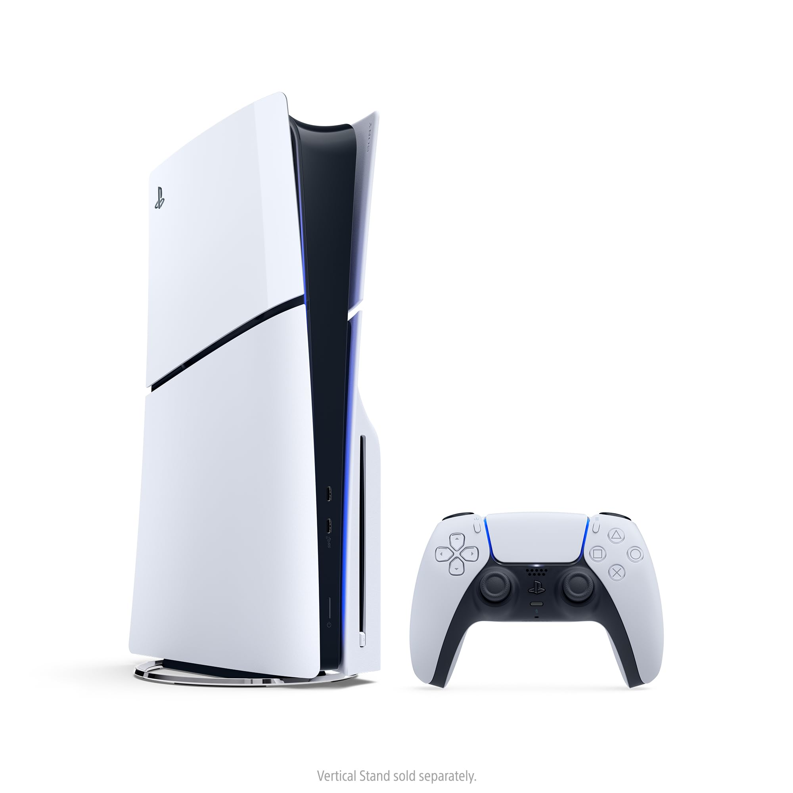
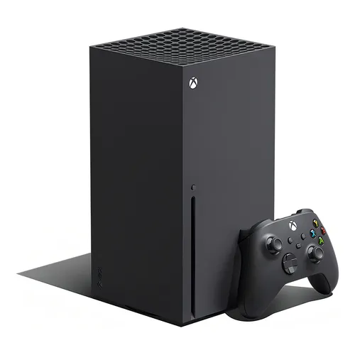

# ⚡ AzureShop — E-Commerce na Nuvem

<div align="center">


### 🌐 [https://cris-noscore.github.io/p1-computacao-nuvem/](https://cris-noscore.github.io/p1-computacao-nuvem/)

**Avaliação P1 — Computação em Nuvem II**  
Curso: DSM — Desenvolvimento de Software Multiplataforma  
FATEC Cotia | 6º Semestre | Noturno | 2026/1  
Prof. Eduardo Tadeu de Almeida  
Aluno: Cristiano Silveira — cristiano.silveira@aluno.cps.sp.gov.br

</div>

---

## 🎮 Produtos da Loja

<div align="center">

| | | | |
|:---:|:---:|:---:|:---:|
|  |  |  |  |
| **Sony PlayStation 5** | **Microsoft Xbox Series X** | **Nintendo Switch OLED** | **Sony DualSense Edge** |
| R$ 4.199,90 | R$ 3.999,90 | R$ 2.799,90 | R$ 1.299,90 |
|  |  |  |  |
| **Valve Steam Deck OLED** | **Xbox Elite Series 2** | **Razer Kishi V2 Pro** | **Nintendo Joy-Con Neon** |
| R$ 5.299,90 | R$ 1.199,90 | R$ 699,90 | R$ 499,90 |

</div>

---

## 📋 Sobre o Projeto

O **AzureShop** é uma aplicação web de e-commerce completa, desenvolvida com tecnologias de nuvem Microsoft Azure. Permite gerenciar produtos (com upload de imagens), clientes e pedidos, utilizando o **Azure Blob Storage** para armazenamento de imagens e o **Azure Table Storage** como banco de dados NoSQL — tudo sem backend, direto do browser via REST API com autenticação SAS.

---

## 🏗️ Arquitetura da Solução

```
┌─────────────────────────────────────────────────────────┐
│                     BROWSER (Cliente)                    │
│                  HTML + CSS + JavaScript                 │
└──────────────────────┬──────────────────────────────────┘
                       │ REST API + SAS Token
          ┌────────────┴────────────┐
          │                         │
┌─────────▼──────────┐   ┌─────────▼──────────┐
│  Azure Blob Storage │   │ Azure Table Storage │
│                     │   │                     │
│  Container:         │   │  Tabelas:           │
│  • cristianosilveira│   │  • CristianoP       │
│    (imagens)        │   │  • CristianoC       │
│                     │   │  • CristianoO       │
└─────────────────────┘   └─────────────────────┘
                       │
            ┌──────────▼──────────┐
            │    GitHub Pages      │
            │  (Hospedagem web)    │
            └─────────────────────┘
```

---

## ☁️ Recursos Azure Utilizados

| Recurso | Tipo | Finalidade |
|---------|------|-----------|
| `stocompnuvem2p1` | Storage Account | Conta principal de armazenamento |
| `cristianosilveira` | Blob Container | Armazenamento exclusivo de fotos dos produtos |
| `CristianoP` | Table Storage | Cadastro de produtos (exclusivo) |
| `CristianoC` | Table Storage | Cadastro de clientes (exclusivo) |
| `CristianoO` | Table Storage | Registro de pedidos (exclusivo) |

### 🔐 Autenticação SAS

Toda comunicação com o Azure é feita via **SAS Token (Shared Access Signature)**, permitindo acesso seguro e temporário aos recursos sem expor as chaves principais.

### 🏷️ Isolamento de Dados

Como a conta Azure é compartilhada entre todos os alunos da turma, foi implementada uma estratégia de isolamento em duas camadas:

1. **Container exclusivo** `cristianosilveira` no Blob Storage — imagens salvas separadamente dos demais alunos
2. **Tabelas exclusivas** `CristianoP`, `CristianoC`, `CristianoO` — dados completamente isolados dos demais alunos

### 🌐 CORS

Configurado via terminal (`curl`) diretamente nas APIs do Azure:

```bash
AllowedOrigins: *
AllowedMethods: GET, PUT, POST, DELETE, OPTIONS, MERGE, HEAD
AllowedHeaders: *
MaxAgeInSeconds: 86400
```

---

## 🚀 Funcionalidades Implementadas

### 📦 Gerenciamento de Produtos (3,0 pontos)
- ✅ Cadastro com marca, modelo, descrição, preço e quantidade
- ✅ Upload de imagem para o Azure Blob Storage (`cristianosilveira`) com URL + SAS
- ✅ Edição e exclusão de produtos
- ✅ Busca por marca, modelo e faixa de preço

### 👥 Gerenciamento de Clientes
- ✅ Cadastro com nome, e-mail, telefone, CPF, endereço e cidade
- ✅ Edição e exclusão
- ✅ Histórico de pedidos por cliente

### 🛒 Checkout de Produtos
- ✅ Carrinho com controle de quantidade
- ✅ Validação de estoque em tempo real
- ✅ Seleção de pagamento (Cartão, PIX, Boleto, Dinheiro)
- ✅ Seleção de entrega (SEDEX, PAC, Expressa, Retirada)
- ✅ Atualização automática do estoque após pedido

### 🖥️ Interface do Usuário (3,0 pontos)
- ✅ Interface web responsiva com tema dark
- ✅ Dashboard com estatísticas em tempo real
- ✅ Painel administrativo completo
- ✅ Modais para cadastro/edição
- ✅ Notificações (toasts) de feedback

### ☁️ Azure Blob Storage (3,0 pontos)
- ✅ Upload de imagens direto do browser para o container `cristianosilveira`
- ✅ Container criado via REST API com `curl`
- ✅ URLs únicas com timestamp + hash aleatório + SAS Token
- ✅ CORS configurado via terminal

### 🗄️ Azure Table Storage (3,0 pontos)
- ✅ Tabelas `CristianoP`, `CristianoC`, `CristianoO` criadas via REST API
- ✅ CRUD completo (Create, Read, Update, Delete)
- ✅ Filtros OData ($filter)
- ✅ CORS configurado via terminal

### 🌍 Publicação (1,0 ponto)
- ✅ **URL:** [https://cris-noscore.github.io/p1-computacao-nuvem/](https://cris-noscore.github.io/p1-computacao-nuvem/)
- ✅ Repositório GitHub público
- ✅ Deploy via GitHub Pages

---

## 🗂️ Estrutura do Projeto

```
p1-computacao-nuvem/
│
├── index.html              # Aplicação principal (SPA)
├── README.md               # Documentação
│
└── assets/
    ├── css/
    │   └── style.css       # Estilos (tema dark, responsivo)
    ├── img/                # Imagens dos produtos (repositório)
    │   ├── play.jpg
    │   ├── xbox.webp
    │   ├── switch.jpg
    │   ├── dual.webp
    │   ├── Steam Deck OLED.jpg
    │   ├── Xbox Elite Series 2.webp
    │   ├── Kishi V2 Pro.webp
    │   └── Joy-Con Neon.webp
    └── js/
        ├── azure.js        # Config Azure + helpers Blob/Table
        ├── produtos.js     # Módulo produtos → tabela CristianoP
        ├── clientes.js     # Módulo clientes → tabela CristianoC
        └── pedidos.js      # Módulo pedidos → tabela CristianoO
```

---

## 🛠️ Configuração via Terminal

Todos os recursos Azure foram criados via **linha de comando (curl)**:

```bash
# 1. Validação das chaves SAS → 200 ✅
curl -s -o /dev/null -w "%{http_code}" \
  "https://stocompnuvem2p1.blob.core.windows.net/?comp=list&..."

# 2. Criação do container exclusivo → 201 ✅
curl -X PUT -H "Content-Length: 0" \
  "https://.../cristianosilveira?restype=container&..."

# 3. Criação das tabelas exclusivas → 201 ✅
curl -X POST -d '{"TableName":"CristianoP"}' "https://.../Tables?..."
curl -X POST -d '{"TableName":"CristianoC"}' "https://.../Tables?..."
curl -X POST -d '{"TableName":"CristianoO"}' "https://.../Tables?..."

# 4. CORS Blob + Table Storage → 202 ✅
curl -X PUT -H "Content-Type: application/xml" \
  -d '<StorageServiceProperties>...' \
  "https://.../?restype=service&comp=properties&..."

# 5. GitHub Pages → publicado ✅
gh api repos/Cris-noscore/p1-computacao-nuvem/pages \
  --method POST -f source[branch]=main -f source[path]=/
```

---

## 📊 Dados de Teste

| Entidade | Quantidade | Tabela Azure |
|----------|-----------|--------------|
| Produtos | 8 (com imagens no Blob `cristianosilveira`) | `CristianoP` |
| Clientes | 10 | `CristianoC` |
| Pedidos | 12 | `CristianoO` |
| **Faturamento total** | **R$ 43.997,80** | — |

---

## 🔗 Links

| Item | Link |
|------|------|
| 🌐 Aplicação publicada | [https://cris-noscore.github.io/p1-computacao-nuvem/](https://cris-noscore.github.io/p1-computacao-nuvem/) |
| 📁 Repositório GitHub | [https://github.com/Cris-noscore/p1-computacao-nuvem](https://github.com/Cris-noscore/p1-computacao-nuvem) |
| ☁️ Storage Account | `stocompnuvem2p1` |
| 📦 Blob Container | `cristianosilveira` |
| 🗄️ Tables | `CristianoP` · `CristianoC` · `CristianoO` |

---

<div align="center">

Desenvolvido com ☁️ **Microsoft Azure** + 🖤 **JavaScript Vanilla** + 🚀 **GitHub Pages**

**FATEC Cotia — DSM 2026**

</div>